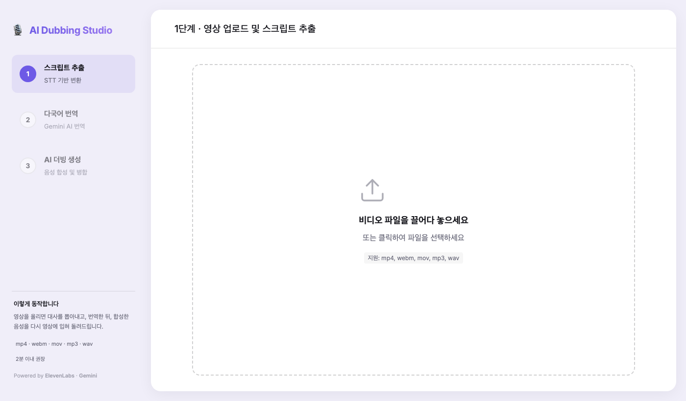

# AI Dubbing Studio

영상을 올리면 **스크립트 추출 → 번역 → 음성 합성 → 영상 병합**까지 한 번에 처리하는 웹앱입니다.
여러 AI 서비스를 하나의 흐름으로 엮어, 더빙 과정을 브라우저에서 끝낼 수 있도록 만들었습니다.



---

## 만든 이유

AI 더빙 서비스의 품질을 검증하는 일을 하면서, **각 단계가 따로 놀면 어디서 품질이 무너지는지 알기 어렵다**는 점이 계속 걸렸습니다.
스크립트가 잘못 추출된 것인지, 번역이 어색한 것인지, 음성 합성 단계의 문제인지 구분하려면 전체 흐름을 한자리에서 볼 수 있어야 했습니다.

그래서 **각 단계의 결과물을 눈으로 확인하고 개별로 수정할 수 있는 형태**로 직접 만들었습니다.
번역문을 고쳐 특정 대사만 다시 합성하거나, 화자별로 다른 목소리를 지정해 비교해볼 수 있습니다.

---

## 동작 흐름

```
영상/음성 업로드
      │
      ├─ 1  스크립트 추출        ElevenLabs STT (화자 분리 포함)
      │        └─ 대사별 카드로 표시 · 직접 수정 가능
      │
      ├─ 2  번역                Gemini 2.5 Flash
      │        └─ 더빙 길이를 고려한 의역 프롬프트 적용
      │
      └─ 3  음성 합성 · 병합     ElevenLabs TTS → FFmpeg
               └─ 화자별 보이스 지정 · 대사 단위 재생성
```

---

## 주요 기능

- **화자 분리(diarization)** — 여러 화자가 등장하는 영상에서 대사를 화자별로 나눠 추출
- **대사 단위 편집** — 번역문을 수정하고 해당 대사만 다시 합성
- **화자별 보이스 지정** — 인물마다 다른 음성으로 더빙
- **타임라인 병합** — 원본 타임코드에 맞춰 합성 음성을 배치하고 FFmpeg으로 영상에 입힘

---

## 기술 스택

| 구분 | 사용 기술 |
|---|---|
| 서버 | Node.js · Express |
| 미디어 처리 | FFmpeg (fluent-ffmpeg) · Multer |
| 음성 인식 / 합성 | ElevenLabs (Scribe v1 · Multilingual v2) |
| 번역 | Google Gemini 2.5 Flash |
| 프런트 | Vanilla JS · CSS (빌드 도구 없음) |
| 배포 | Vercel |

---

## 실행 방법

### 1. 사전 준비

**FFmpeg**이 설치되어 있어야 합니다.

```bash
# macOS
brew install ffmpeg
```

### 2. 설치

```bash
git clone https://github.com/jsbyun0301-bot/AI-dubbing-app.git
cd AI-dubbing-app
npm install
```

### 3. API 키 설정

`.env.example`을 복사해 `.env`를 만들고 키를 채웁니다.

```bash
cp .env.example .env
```

```env
ELEVENLABS_API_KEY=your_key_here
GEMINI_API_KEY=your_key_here
```

| 키 | 발급처 | 용도 |
|---|---|---|
| `ELEVENLABS_API_KEY` | [elevenlabs.io](https://elevenlabs.io) → Profile → API Keys | 음성 인식 · 음성 합성 |
| `GEMINI_API_KEY` | [aistudio.google.com/apikey](https://aistudio.google.com/apikey) | 스크립트 번역 |

> `.env`는 `.gitignore`에 포함되어 있어 저장소에 올라가지 않습니다.

### 4. 실행

```bash
npm start
```

브라우저에서 `http://localhost:3000` 으로 접속합니다.

---

## API 키 처리 방식

**키는 서버에만 두고, 브라우저로 내려보내지 않습니다.**

```
브라우저  ──>  /api/stt · /api/translate · /api/tts  ──(키)──>  ElevenLabs · Gemini
```

클라이언트는 외부 API를 직접 호출하지 않고 서버 엔드포인트만 호출합니다.
초기 버전은 브라우저가 키를 받아 벤더를 직접 호출하는 구조였으나, 키가 응답에 노출되는 문제가 있어 서버 프록시로 전환했습니다.

### 사용량 제한

공개 배포 환경에서 과도한 호출을 막기 위해 상한을 두었습니다. 환경변수로 조정할 수 있습니다.

| 항목 | 기본값 | 환경변수 |
|---|---|---|
| 업로드 파일 크기 | 25 MB | `MAX_UPLOAD_MB` |
| 음성 합성 문장 길이 | 600자 | `MAX_TTS_CHARS` |
| 번역 요청 길이 | 12,000자 | `MAX_PROMPT_CHARS` |
| IP당 시간별 호출 | 30회 | `RATE_LIMIT_PER_HOUR` |

---

## 프로젝트 구조

```
├─ server.js              Express 서버 · API 프록시 · FFmpeg 병합
├─ public/
│   ├─ index.html         3단계 UI
│   ├─ app.js             업로드 · 편집 · 합성 흐름 제어
│   └─ styles.css
├─ .env.example           키 설정 템플릿
└─ vercel.json            배포 설정
```

### 엔드포인트

| 메서드 | 경로 | 설명 |
|---|---|---|
| `POST` | `/api/stt` | 음성/영상 → 스크립트 (화자 분리) |
| `POST` | `/api/translate` | 스크립트 번역 |
| `POST` | `/api/tts` | 텍스트 → 음성 |
| `POST` | `/api/merge-video` | 합성 음성을 원본 영상에 병합 |

---

## 한계와 이후 과제

- 긴 영상은 처리 시간이 길고, 서버리스 환경의 실행 시간 제한에 걸릴 수 있습니다
- 번역 품질은 프롬프트에 의존하며, 자동 평가 절차는 아직 없습니다
- 진행 상태를 세밀하게 보여주는 UI가 부족합니다

---

## 배경

사내 개발 교육 과정에서 학습한 내용을 적용해 기획부터 구현·배포까지 직접 진행한 프로젝트입니다.
AI 더빙·번역 품질 검증 업무에서 느낀 불편을 직접 도구로 만들어보는 것이 목표였습니다.

**변지섭** · [포트폴리오](https://jsbyun0301-bot.github.io)
